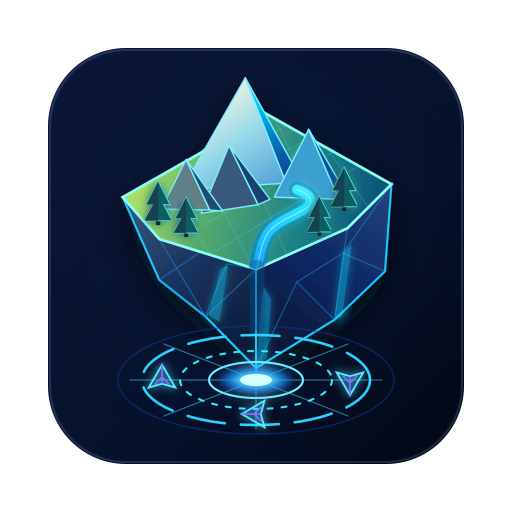

<div align="center">
  
  <h1>Immersive Web Simulation Forge</h1>
  <p>브라우저 기반 월드, 시뮬레이션, 데이터 도구, 인터랙티브 제품을 설계·구현·검증하기 위한 Codex 스킬 패키지</p>
</div>

<p align="center">
  <a href="docs/">Examples showcase</a> ·
  <a href="immersive-web-simulation-forge/SKILL.md">Skill instructions</a> ·
  <a href="immersive-web-simulation-forge/skill.yaml">Runtime metadata</a>
</p>

## 개요

Immersive Web Simulation Forge는 인터랙티브 브라우저 제품을 만들 때 필요한 설계 기준, 재사용 모듈, 검증 도구를 묶은 스킬입니다.

다음과 같은 제품 유형을 대상으로 합니다.

- 브라우저 기반 open world와 game arena
- 물리·과학·공학 simulation lab
- 파라메트릭 design studio와 configurator
- 데이터 instrument와 operations panel
- ambient system과 dashboard panel

이 저장소의 `examples/`는 스킬로 제작된 결과물을 보여주는 전시·검증 자료입니다. 스킬 본체는 [`immersive-web-simulation-forge/`](immersive-web-simulation-forge/)에 있습니다.

## 핵심 구성

스킬은 다음 세 영역을 서로 분리해 기록하도록 안내합니다.

1. **제품 경험** — 첫 사용, 핵심 행동, 결과 확인, 완료와 복구
2. **도메인 근거** — 단위, 모델, 가정, 검증 기준, 허용오차와 제한사항
3. **런타임 동작** — lifecycle, 입력, 상태 저장, 취소, 성능 측정과 패키징

시각적 결과만으로 물리적 정확성이나 성능을 주장하지 않도록 하는 것이 주요 원칙입니다.

## 제공 모듈

`kits/`에는 프로젝트의 시작점으로 사용할 수 있는 모듈이 들어 있습니다.

- `runtime/` — 고정 스텝 프레임 루프, lifecycle, 해상도 정책
- `compute/` — Worker 또는 메인 스레드 작업 실행, 진행률, 취소
- `authoring/` — 파라미터 정의, undo/redo, 상태 변경
- `io/` — 버전이 있는 프로젝트 직렬화, migration, round trip
- `systems/` — 공유 필드와 이벤트 디렉터
- `three/`, `canvas/`, `webgl/` — 공간 렌더링, 필드, resolve와 후처리 기반
- `analysis/` — 측정 시리즈, 요약, plot과 CSV 출력
- `input/`, `ui/` — pointer look과 SVG 아이콘 시스템

`references/`에는 profile 선택, 물리 검증, parametric design, perceptual fidelity, 측정 기준 등의 상세 지침이 있습니다.

## Requierments

Python 3.10 이상과 Node.js 20 이상이 필요합니다.

스킬 패키지 상태를 확인합니다.

```bash
python3 immersive-web-simulation-forge/scripts/forge.py doctor
```

브라우저 실행 검증에는 Playwright가 필요합니다.

```bash
node immersive-web-simulation-forge/scripts/browser_verify.mjs my-project \
  --workflow-test \
  --domain-test
```

## 설치

이 저장소를 독립 스킬로 설치하려면 다음 명령을 사용할 수 있습니다.

```bash
npx skills add ictseoyoungmin/immersive-web-simulation-forge --agent claude-code
npx skills add ictseoyoungmin/immersive-web-simulation-forge --agent codex
```

다른 에이전트를 대상으로 설치할 때는 `--agent` 값을 해당 에이전트 이름으로 바꿉니다.

이 저장소에는 Codex용 `.codex-plugin/plugin.json`과 Claude Code용 `.claude-plugin/plugin.json`이 포함되어 있습니다. 두 매니페스트는 `skills/immersive-web-simulation-forge/`를 플러그인 진입점으로 노출하며, 실제 지침과 리소스는 canonical `immersive-web-simulation-forge/` 폴더에서 사용합니다.

## 제작 기록

이 스킬은 Codex `skill-creator`를 사용해 만들었습니다. 저장소의 예제는 `gpt-5.6-sol-high`를 사용해 단일 프롬프트로 작성된 결과물입니다. `k-holo-status-openworld-revision`은 첫 결과물에서 한번 수정된 결과입니다.

단일 프롬프트 예제:

- [`examples/0.6.0/AEROLAB_X4_Drone_Wind_Tunnel/PROMPT.md`](examples/0.6.0/AEROLAB_X4_Drone_Wind_Tunnel/PROMPT.md)


## 저장소 구조

```text
.
├── .codex-plugin/                     # Codex plugin manifest
├── .claude-plugin/                   # Claude Code plugin manifest
├── docs/                              # GitHub Pages 예제 전시 페이지
├── examples/                          # 버전별 브라우저 예제와 검증 자료
├── skills/                            # Plugin-discoverable skill entry points
│   └── immersive-web-simulation-forge/
└── immersive-web-simulation-forge/    # 배포 대상 스킬 패키지
    ├── SKILL.md                       # 스킬 지침
    ├── agents/openai.yaml             # Codex 메타데이터
    ├── skill.yaml                     # 런타임 메타데이터
    ├── assets/                        # 아이콘 등 배포 자산
    ├── kits/                          # 재사용 구현 모듈
    ├── references/                    # 선택적으로 읽는 전문 지침
    ├── scripts/                       # audit, verify, package 도구
    ├── templates/                     # 계획·검증 템플릿
    └── tests/                         # Forge 자체 테스트
```

## 범위와 제한

- `visual-concept` 예제는 시각적·상호작용적 결과를 위한 것이며 실제 물리·식물학·음향학 모델을 의미하지 않습니다.
- 공학적 또는 의사결정 지원 수준의 주장은 외부 기준, 알려진 사례, 허용오차와 검토 기록이 필요합니다.
- 브라우저 성능 결과는 GPU, 브라우저, 해상도와 실행 환경에 따라 달라질 수 있습니다.
- `examples/`는 스킬 패키지 자체에 필수인 런타임 파일이 아니라 전시·검증 자료입니다.

## 라이선스

MIT
